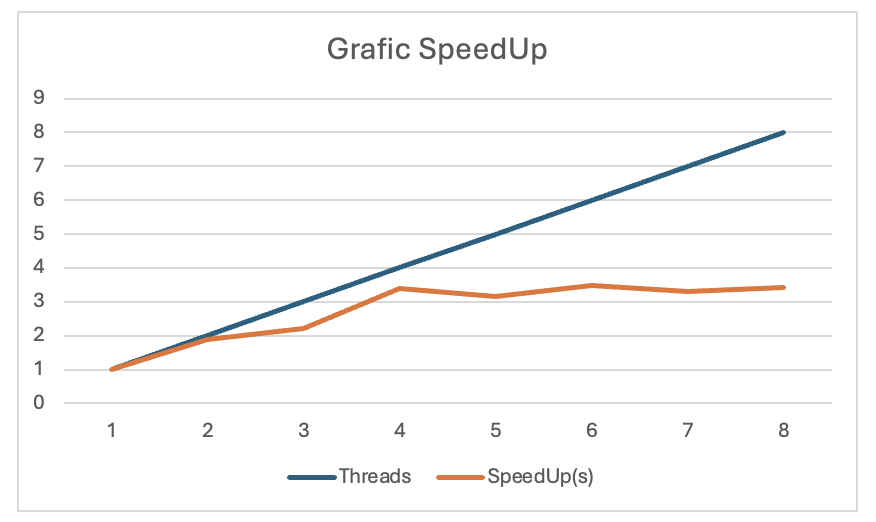

# News Aggregator – Parallel Java Application

A scalable and efficient **parallel news aggregation system** implemented in Java. The application processes large collections of news articles stored in JSON format, removes duplicates, organizes articles by categories and languages, and generates multiple statistics and reports. The project was developed as part of a Parallel and Distributed Algorithms course, with a strong focus on correctness, synchronization, and scalability.

---

## Overview

Modern news platforms need to handle large volumes of data originating from multiple sources. This project simulates the core functionality of a real-world news aggregator by processing thousands of articles in parallel and producing deterministic, well-structured outputs.

The application:
- Reads and parses large JSON datasets containing news articles
- Detects and removes duplicate articles (by `uuid` or `title`)
- Organizes articles by **category** and **language**
- Counts keyword occurrences in English articles
- Computes author-based and global statistics
- Writes all results to human-readable text files

The solution is designed to scale with the number of worker threads and to make efficient use of multi-core systems.

---

## Architecture

The program follows a **multi-phase parallel pipeline**, where each phase is clearly separated and synchronized to ensure correctness.

### Processing Phases

1. **Initialization (Sequential)**
   - Parse command-line arguments
   - Read auxiliary input files (categories, languages, stop words)
   - Initialize shared data structures

2. **Article Ingestion (Parallel)**
   - JSON files are processed in parallel using a *Replicated Workers* model
   - Each worker thread pulls file paths from a shared task queue
   - Duplicate detection is performed during ingestion

3. **Duplicate Removal (Single Thread)**
   - After all ingestion threads finish, duplicate articles are removed
   - Ensures no invalid articles reach later stages

4. **Article Processing & Aggregation (Parallel)**
   - Articles are processed in parallel and mapped to:
     - categories
     - languages
     - authors
     - keywords (English-only)

5. **Output Generation (Parallel + Sequential)**
   - Output files are generated in parallel (categories, languages, keywords, etc.)
   - A single thread generates the final summary report

---

## Parallelization Strategy

### Task Distribution

- The application uses a **fixed number of threads**, created once at startup
- Work is distributed dynamically using thread-safe queues
- Threads that finish early automatically pick up new tasks

This approach ensures:
- High CPU utilization
- Minimal idle time
- Good load balancing even with uneven input sizes

### Synchronization Mechanisms

The following concurrency primitives are used:

- **CyclicBarrier**
  - Synchronizes major processing phases
  - Guarantees that all threads complete a phase before the next one begins

- **ConcurrentHashMap**
  - Used for all shared maps (articles, categories, languages, authors, keywords)
  - Provides thread-safe access with fine-grained locking

- **AtomicInteger / AtomicBoolean**
  - Used for counters and one-time execution guarantees
  - Eliminates race conditions without explicit locks

- **LinkedBlockingQueue**
  - Manages task pools for file ingestion and final output generation
  - Ensures safe concurrent access by multiple threads

---

## Correctness & Design Rationale

The design ensures correctness and efficiency through:

- **Strict phase separation** using barriers, preventing race conditions
- **Deterministic results**, regardless of thread scheduling
- **Thread-safe data structures** for all shared state
- **Single-threaded cleanup and reporting**, where required by logic

This architecture mirrors real-world parallel data processing systems and avoids common pitfalls such as busy waiting, ad-hoc synchronization, or thread oversubscription.

---

## Output Files

The program generates the following outputs:

- `all_articles.txt` – all valid articles sorted by publication date (descending)
- `<category>.txt` – article UUIDs grouped by category
- `<language>.txt` – article UUIDs grouped by language
- `keywords_count.txt` – keyword frequency in English articles
- `reports.txt` – global statistics summary

All outputs are deterministic and reproducible across runs.

---

## Performance & Scalability

- The most expensive operations (JSON parsing and text processing) are fully parallelized
- The system scales well with the number of threads up to the number of available CPU cores
- Dynamic task scheduling minimizes synchronization overhead

Empirical tests show consistent speedup as the number of threads increases, until hardware limits are reached.

---

## Technologies Used

- **Jackson** – JSON parsing
- **Java Concurrency API** (`Thread`, `ConcurrentHashMap`, `Atomic*`, `CyclicBarrier`)

---

## Main skills
This project demonstrates:
- Practical use of parallel programming in Java
- Clean separation between sequential and parallel logic
- Correct handling of synchronization and shared data
- Scalable design suitable for real-world data processing pipelines
- It reflects the type of concurrency challenges encountered in backend systems, data engineering, and distributed applications.

--- 
## Performance & Scalability Analysis

### Test Setup

- **CPU:** Apple M1, 8 cores  
- **RAM:** 8 GB  
- **Operating System:** macOS Tahoe 26.1  
- **Java Version:** OpenJDK 24.0.1    
- **Dataset Size:**  
  - ~470 MB of raw data  
  - 13,789 JSON files  
  - 89,213 processed articles  

### Results

| Threads | Run 1 (s) | Run 2 (s) | Run 3 (s) | Avg Time (s) | Speedup | Efficiency |
|--------:|----------:|----------:|----------:|-------------:|--------:|-----------:|
| 1 | 13.122 | 15.292 | 14.740 | 14.385 | 1.000 | 1.000 |
| 2 | 7.093 | 8.026 | 7.756 | 7.625 | 1.887 | 0.943 |
| 3 | 6.554 | 5.550 | 7.529 | 6.544 | 2.198 | 0.733 |
| 4 | 4.711 | 3.984 | 4.030 | 4.242 | 3.391 | 0.848 |
| 5 | 4.667 | 4.389 | 4.618 | 4.558 | 3.156 | 0.631 |
| 6 | 4.418 | 3.942 | 4.032 | 4.131 | 3.482 | 0.580 |
| 7 | 4.612 | 4.256 | 4.232 | 4.367 | 3.294 | 0.471 |
| 8 | 4.794 | 3.578 | 4.208 | 4.193 | 3.430 | 0.429 |

---

### Analysis

#### Observed Behavior

By analyzing the execution times and the speedup curve, two distinct phases can be identified:

- **Near-linear scaling (1–4 threads):**  
  Performance scales almost linearly from 1 to 4 threads. The measured speedup reaches **3.39**, while efficiency remains high (above **0.85 on average**).  
  This indicates that the algorithm successfully parallelizes the most expensive operations, such as JSON parsing and text processing.

- **Performance saturation (5+ threads):**  
  Starting from 5 threads, the speedup curve begins to flatten. Although execution time continues to decrease slightly, the performance gains become marginal compared to the additional resources used. Efficiency drops below **50%**, signaling diminishing returns.

---

#### Limiting Factors

1. **Heterogeneous CPU architecture:**  
   The Apple M1 processor consists of **4 performance cores and 4 efficiency cores**. When using more than 4 threads, execution starts to rely on efficiency cores, which cannot sustain the same processing throughput, thus limiting scalability.

2. **Increased contention on shared data structures:**  
   With a higher number of threads (especially at 8), concurrent access to shared structures such as `ConcurrentHashMap` (used for words and categories) becomes more frequent.  
   Although non-blocking mechanisms reduce contention, cache coherence and synchronization overhead between cores become noticeable.

---

#### Optimal Number of Threads

If execution time alone is considered, **6 threads** provide the best raw performance.  
However, when evaluating **resource efficiency versus performance**, **4 threads** represent the optimal configuration:  
they achieve approximately **95% of the maximum performance while using only 50% of the available cores**.

This makes 4 threads the best practical choice for this system.

